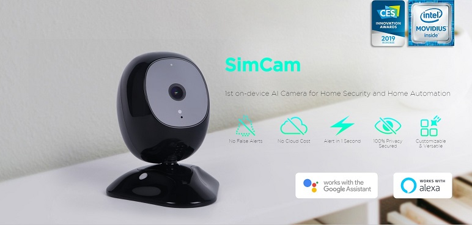
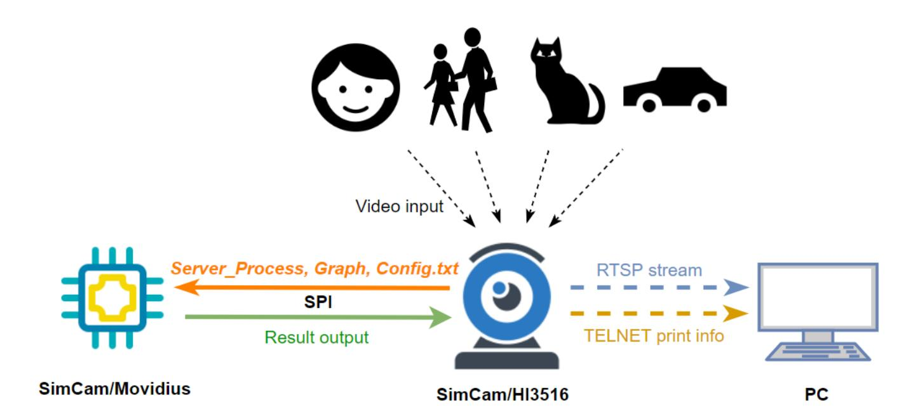

# [SimCam](https://simcam.ai/) AI Camera.

The first on-device AI Security Camera for smart home.

The SimCam uses AI for facial recognition, pet monitoring, and more via location training. The SimCam has a 5 megapixel image sensor with night vision for still images and 1080 HD videos. The IP65 waterproof rated indoor/outdoor, camera can rotate 360 degrees while tracking objects.

With the open SDK of SimCam, you can customize the settings to meet your needs.

The work flow of SimCam in developer mode is shown in the following figure.

As shown in the figure, SimCam consists of two embedded boards, one is HI3516
and another is Movidius. HI3516 is used for video capture and video play. Movidius is
used for deep learning computing. Two embedded boards communicate by SPI.
There are some documents for developers inside [docs](./docs/) folder including :
   * [Quick start guide of SimCam in developer mode](docs/Quick Start guide of SimCam in Developer Mode.pdf);
   * [Toolchain installation and usage guide](docs/Guide of Tool Chain Installation and Use.pdf);
   * [SimCam API guide](docs/Guide of SIMcam SDK APIs.pdf);

Developers can train their own object detection models using Caffe deep learning framework and  neural network architecture provided by SimCam team. Instruction can be found in [this document](./docs/Train_Model.pdf)

### Support
If you need any help, please post us an issue on [Github Issues](https://github.com/simshineaicamera/SIMCAM_SDK/issues).  You are welcome to contact us for your suggestions!
