# [SimCam](https://simcam.ai/) AI Camera.

The first on-device AI Security Camera for smart home.


<div style="text-align: justify">
The SimCam uses AI for facial recognition, pet monitoring, and more via location training. The SimCam has a 5 megapixel image sensor with night vision for still images and 1080 HD videos. The IP65 waterproof rated indoor/outdoor, camera can rotate 360 degrees while tracking objects.
</div>
With the open SDK of SimCam, you can customize the settings to meet your needs.

The work flow of SimCam in developer mode is shown in the following figure.


As shown in the figure, SimCam consists of two embedded boards, one is HI3516 and another is Movidius. HI3516 is used for video capture and video play. Movidius is used for deep learning computing. Two embedded boards communicate by spi.

There are some documents for developers inside [docs](./docs/) folder including :

   * [Quick start guide of SimCam in developer mode](docs/Quick_Start_Guide.pdf);
   * [Toolchain installation and usage guide](docs/Guide_of_Tool_Chain_Installation_and_usage.pdf);
   * [SimCam API guide](docs/Guide_of_SimCam_SDK_APIs.pdf);
   * [How to train object detection model](docs/How_To_Train_Model.pdf)

However, here is some guide for really really quick starters :running: Let's get started:smile:
* [Installation](#installation)
* [Run_detection_demo](#run_detection_demo)
* [Face_recognition_demo](#face_recognition_demo)
* [Train_Caffe_model](#train_caffe_model)
* [Video_Surveillance_with_SimCam](#Video_Surveillance_with_SimCam)

### Installation

1. Get the SDK. We will call the directory that you cloned SIMCAM SDK into `$SIMCAM_SDK`
```Shell
git clone https://github.com/simshineaicamera/SIMCAM_SDK.git
cd SIMCAM_SDK
```
Here is SDK folder tree:
```bash
SIMCAM_SDK
├── docs
├── examples
├── img
├── libs
├── src
├── tools
└── train
```
Note* if you want to run only detection demo, you can skip installation process and jump to [Run_detection_demo](#run_detection_demo). However, for face recognition demo and future developments you need to install SIMCAM SDK tools.

#### HI3516 toolchain installation
2. Enter `$SIMCAM_SDK/tools/arm_toolchain` folder, and execute below commands:
```Shell
cd $SIMCAM_SDK/tools/arm_toolchain
sudo chmod +x cross.v300.install
sudo ./cross.v300.install
```
3. If you have 64-bit OS, you need to install 32-bit OS compiler compatibility packages:
```Shell
sudo apt-get install lib32z1
sudo apt-get install lib32stdc++6-4.8-dbg
```
4. Add toolchain path to environment variable
```Shell
vi ~/.bashrc
export PATH="/opt/hisi-linux/x86-arm/arm-hisiv300-linux/target/bin:$PATH"
```
5. Reload .bashrc file
```Shell
source ~/.bashrc
```
6. Execute below command to check toolchain version:
```Shell
arm-hisiv300-linux-gcc  -v
```
If you can see “gcc version 4.8.3 20131202 (prerelease) (Hisilicon_v300)” at the end of
the version description, Congratulations!,  the toolchain installation is finished successfully.
#### Movidius toolchain installation
7. Enter `$SIMCAM_SDK/tools/mv_toolchain/model_conversion/` folder and execute `install-ncsdk.sh` script
```Shell
cd $SIMCAM_SDK/tools/mv_toolchain/model_conversion/
sudo ./install-ncsdk.sh
```
This script will install Movidius model conversion toolkit, and also caffe-ssd cpu version on your system. Execute below commands to see Movidius moldel conversion toolkit.

```bash
mvNCCompile -h
mvNCCompile v02.00, Copyright @ Movidius Ltd 2016

usage: mvNCCompile [-h] [-w WEIGHTS] [-in INPUTNODE] [-on OUTPUTNODE]
                   [-o OUTFILE] [-s NSHAVES] [-is INPUTSIZE INPUTSIZE]
                   network

mvNCCompile.py converts Caffe or Tensorflow networks to graph files that can
be used by the Movidius Neural Compute Platform API

positional arguments:
  network               Network file (.prototxt, .meta, .pb, .protobuf)

optional arguments:
  -h, --help            show this help message and exit
  -w WEIGHTS            Weights file (override default same name of .protobuf)
  -in INPUTNODE         Input node name
  -on OUTPUTNODE        Output node name
  -o OUTFILE            Generated graph file (default graph)
  -s NSHAVES            Number of shaves (default 1)
  -is INPUTSIZE INPUTSIZE
                        Input size for networks that do not provide an input
                        shape, width and height expected
```
If you can see above result, congratulations you have finished installation, it was really easy, right?!
#### Install opencv
Note* If you have already installed opencv>=3.4.3 versions you can skip this step.

8. Enter `$SIMCAM_SDK/tools/` folder and run `install_opencv.sh` script :
```Shell
cd $SIMCAM_SDK/tools/
sudo ./install_opencv.sh
```
Above command will install opencv 3.4.3 version on your system.
Hurray,  we have finished installation process completely! We can move on more interesting parts.

### Run_detection_demo
1. Prepare sd card and your SIMCAM AI camera, if you still don't have the camera , buy one from [here](https://store.simcam.ai/products/ai-camera-indoor).
2. Copy following files into your sd card, files are located inside the `$SIMCAM_SDK\src` folder:
```Shell
├── config.txt
├── Detect_Server_Process
├── emotion
├── gender
├── person_face
├── rootfs
├── rtl_hostapd_2G.conf
```
and also `$SIMCAM_SDK\examples\Detect_Demo` executable file.

3. Open config.txt file to be familiar with it, it is in json format, here is written a brief introduction about config file and parameters inside it.
```bash
{
"wifi_mode":"AP_MODE",  # In AP_MODE,the camera creates LAN hotspot, in STA_MODE,  connects to the internet.
"if_send":0, # switch to 1 if you want to send detection results to your server.
"server_IP":"118.190.201.26", # you can set your server's IP address.
"port":8001, # your server's port
"model":[{  
    "model_have":1,    # model switch parameter, 0 or 1.   
    "input_width":300, #  input width
    "input_height":300,# input height
    "shave_num":6,     # number of shaves when you convert the detection graph
    "input_color":1,   # input color 1 for RGB, 0 for Gray
    "mean0":127.5,     # image processing parameters
    "mean1":127.5,     # image processing parameters
    "mean2":127.5,     # image processing parameters
    "std":127.5,       # image processing parameters
    "label":3,        # this parameter in use for classification models,
    "conf_thresh":0.5  # confidence threshold
},
{
    "model_have":1,
    "input_width":64,
    "input_height":64,
    "shave_num":1,
    "input_color":0,
    "mean0":127.5,
    "mean1":0,
    "mean2":0,
    "std":127.5,
    "label":3,  # face class id in our person_face detection model.
    "conf_thresh":0.5
},
{
    "model_have":1,
    "input_width":64,
    "input_height":64,
    "shave_num":2,
    "input_color":0,
    "mean0":127.5,
    "mean1":127.5,
    "mean2":127.5,
    "std":127.5,
    "label":3,
    "conf_thresh":0.5
}]
}
```
SIMCAM camera can run 3 deep learning models simultaneously, first one is detection model, another two are classification models.

4. Insert sd card to the camera and power on it. In default config.txt, SIMCAM camera runs in AP_MODE, and creates LAN hotspot with default ssid=REVO_DPL, password=87654321, and IP = 192.168.0.1.

5. Connect your PC or laptop to the REVO_DPL wifi. Open your terminal and run following commands:
```Shell
telnet 192.168.0.1
```

6. Default user login is `root` and password is blank.

7. Enter `/mnt/DCIM/` folder and run Detect_Demo executable file:

```bash
cd /mnt/DCIM/
./Detect_Demo
```

8. And that's it, you are running SIMCAM camera with person and face detection,and also gender and emotion classification models.
You can see results on the terminal like below:
```bash
shmid=0
ntpd: bad address 'us.ntp.org.cn'
send app Detect_Server_Process size :862620
sleep 3s for 2450 boot up
fd : 4,ret : 0
ssd cfg size:136
person_face size:1378032
gender size:124760
emotion size:124760
No detection, spi loop>>>>>>>>>>>>>>>>>>>>>>>>
No detection, spi loop>>>>>>>>>>>>>>>>>>>>>>>>
DetectionModelResult: class: 1, x1: 0.002197, y1: 0.007080, x2: 0.660156, y2: 0.994141
DetectionModelResult: class: 1, x1: 0.011475, y1: 0.007813, x2: 0.713867, y2: 0.995117
DetectionModelResult: class: 3, x1: 0.011475, y1: 0.007813, x2: 0.713867, y2: 0.995117
FirstClassificationModelResult, class0: 0.354736
FirstClassificationModelResult, class1: 0.645020
SecondClassificationModelResult, class0: 0.051086
SecondClassificationModelResult, class1: 0.508789
......
```

If you want to see real time results with bounding boxes, you can install **VLC media player**  on your machine, and open network streams at this address: *rtsp://192.168.0.1* .
Another option is **Kalay** app for mobile phones, both for Android and ios. But please make sure your smart phone is connected REVO_DPL wifi.

### Face_recognition_demo
I hope you have already successfully run our [detection demo](#run_detection_demo) and you have already become close friend with SIMCAM camera. Next step is to be familiar with face recognition demo.
1. Prepare face images of people in the folder with their names, those who you want to identify by using SIMCAM camera, at least one picture for one person. Here is an example:
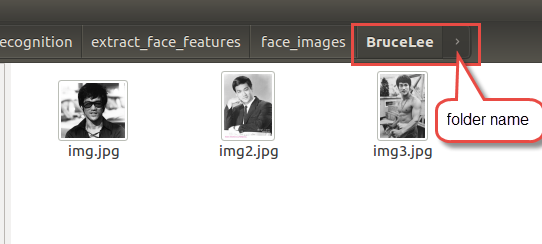
2. Copy your folders into: `$SIMCAM_SDK/examples/face_recognition/extract_face_features/face_images`
```bash
cp -r BruceLee/ $SIMCAM_SDK/examples/face_recognition/extract_face_features/face_images
```
3. Open terminal inside `$SIMCAM_SDK/examples/face_recognition/extract_face_features`, and execute following command:
```bash
./main face_images/
```
This command will extract face features of each person and save them into `faces.db` sqlite database.

4. We consider, you have already copied files inside `$SIMCAM_SDK\src` folder into your sd card,and then copy another necessary files into your sd card:
```bash
cp $SIMCAM_SDK/examples/face_recognition/extract_face_features/faces.db $sdcardpath # face features database
cp $SIMCAM_SDK/examples/face_recognition/Demo $sdcardpath  # demo executable for face recognition
cp $SIMCAM_SDK/examples/models/lcnn/lcnn $sdcardpath # face feature extractor model,
```
5. Open `config.txt` file and do following changes (marked as changing line):
```bash
{
"wifi_mode":"AP_MODE",  
"if_send":0,
"server_IP":"118.190.201.26",
"port":8001,
"model":[{  
    "model_have":1,    
    "input_width":300,
    "input_height":300,
    "shave_num":6,     
    "input_color":1,   
    "mean0":127.5,     
    "mean1":127.5,     
    "mean2":127.5,     
    "std":127.5,       
    "label":3,        
    "conf_thresh":0.5
},
{
    "model_have":1,
    "input_width":128,  # changing line, changed 64->128
    "input_height":128, # changing line  changed 64->128
    "shave_num":2,       # changing line changed 1->2
    "input_color":0,
    "mean0":0,           # changing line changed 127.5->0
    "mean1":0,
    "mean2":0,
    "std":256,  #  changing line changed 127.5->256
    "label":3,  
    "conf_thresh":0.5
},
{
    "model_have":0,     # changing line changed 1->0
    "input_width":64,
    "input_height":64,
    "shave_num":2,
    "input_color":0,
    "mean0":127.5,
    "mean1":127.5,
    "mean2":127.5,
    "std":127.5,
    "label":3,
    "conf_thresh":0.5
}]
}
```
You can find model parameters information for each model in the model folder.

6. Connect the camera through `telnet`  and execute `Demo`. You will get results similar to this:
```Shell
/mnt/DCIM ./Demo
shmid=0
send app Detect_Server_Process size :862620
sleep 3s for 2450 boot up
fd : 4,ret : 0
ssd cfg size:136
person_face size:1378032
lcnn size:2786192
No detection, spi loop>>>>>>>>>>>>>>>>>>>>>>>>
DetectionModelResult: class: 1, x1: 0.051270, y1: 0.007813, x2: 0.909180, y2: 0.971680
DetectionModelResult: class: 3, x1: 0.051270, y1: 0.007813, x2: 0.909180, y2: 0.971680
Recognized as : BruceLee
......
```

### Train_Caffe_model

Developers can train their own object detection models using Caffe deep learning framework and  neural network architecture provided by SimCam team.
Instruction can be found in [this document](./docs/How_To_Train_Model.pdf).
Training your own custom object detection model is very easy using SIMCAM SDK,if you have already finished installation process, and all you need is video files contain desired object. Here is a simple guide how to do it.
#### Preparing data for training:
1. Open SIMCAM SDK folder and copy  all your video files into `$SIMCAM_SDK/train/data/Images_xmls/videos` folder
2. Open terminal in `$SIMCAM_SDK/train/data/Images_xmls` folder and run `video2img.py` python script:
```Shell
cd $SIMCAM_SDK/train/data/Images_xmls/
python3 video2img.py
```
It will save one frame as an image per second in JPEGImages folder by default. However, there are options; you can change input folder, output folder and number of frames to save.
```Shell
python3 video2img.py -h
usage: video2img.py [-h] [--input INPUT] [--output OUTPUT]
                    [--num NUMFRAMEPERSECOND]
optional arguments:
  -h, --help            show this help message and exit
  --input INPUT, -i INPUT
                        video input path
  --output OUTPUT, -o OUTPUT
                        output path
  --num NUMFRAMEPERSECOND, -n NUMFRAMEPERSECOND
                        num frame to get per second
```
3. Image annotation. You should annotate extracted images manually. We have provided an open source annotation tool named labelImg. That tool provides the object coordinate in xml format as output for further processing.  Simple annotations steps are shown below:
  * Execute  labelImg file,  open  image  dataset  folder (in our case JPEGImages folder) by  clicking the OpenDir icon on the left pane.
  * Image will appear. Click “Change Save Dir” icon and choose Annotations folder as a save folder. Draw rectangle boxes around the objects by clicking the Create RectBox icon and give a label. These boxes are called bounding boxes.
  * Repeat second step for the each image that appears. Below image shows an example of an annotated image.
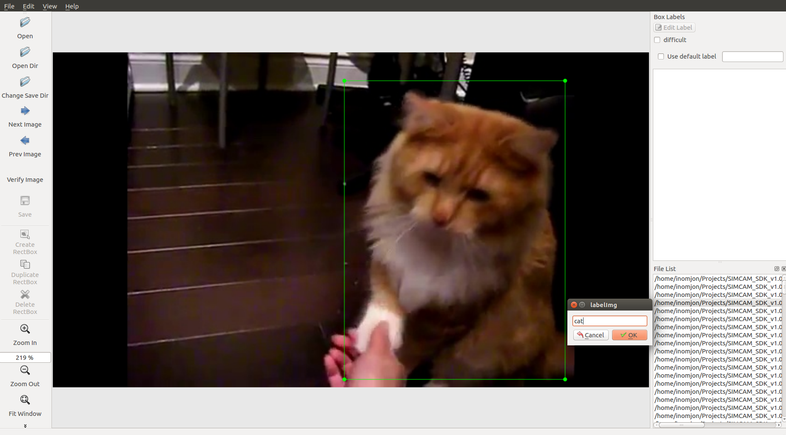
4. If you finished all above steps completely, you get bunch of xml files (annotations) inside Annotation folder and images JPEGImages folder.
5. Open terminal inside the `$SIMCAM_SDK/train/data/Images_xmls` folder and run `create_txt.py`  python script:
```Shell
python create_txt.py
```
6. This python script will create `train.txt`, `test.txt`, `trainval.txt` and `val.txt` files in the `$SIMCAM_SDK/train/data/Images_xmls/ImageSets/Main` folder
7. Go in `$SIMCAM_SDK/train/data/lmdb_files` folder and create your own `labelmap.prototxt` file, example has exist in the folder; you can change it according to your dataset.

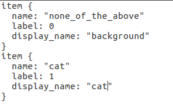

8. In the terminal run create_list.sh script :
```Shell
./create_list.sh
```
It will generate `trainval.txt`, `test.txt`, `test_name_size.txt` files in the folder
9. Last step is generating lmdb files, lmdb is caffe’s data format for training.
In the terminal run `create_data.sh` script:
```Shell
./create_data.sh
```
It will create trainval_lmdb and test_lmdb files in the lmdb folder.

#### Train model:
So now, you nearly got everything ready to train the Network with the data prepared by yourself. The last thing is, the Network!  SIMCAM team provide a robust Network and all necessary scripts for you to train and deploy your own model on the SIMCAM products.
1. Run `gen_model.sh` script to generate Network:

```Shell
./gen_model.sh  <num>
```
“num” is number of classes in your dataset including the background class.  It will create prototxts folder and .prototxt files inside the folder for training, testing and deploying the model.
2. If you do not have at least Get Force GTX 1060 or higher version of GPU hardware on your Ubuntu machine, you can skip this step. Because while you are installing SIMCAM SDK and Toolchain it installs caffe-ssd CPU version on your machine automatically, in /opt/movidius/ssd-caffe path. Let’s install GPU version of caffe-ssd to speed up your training process.  
To make process simpler, SIMCAM team has provided docker image in docker hub, and Dockerfile for installation GPU version of caffe-ssd. All you should to do is having docker and nvidia-docker on your Ubuntu system. [Here](https://docs.docker.com/install/) is some information about docker and installation process of [docker](https://docs.docker.com/install/linux/docker-ce/ubuntu/) and [nvidia-docker](https://github.com/NVIDIA/nvidia-docker). Let’s see simple steps to pull and run  `simcam/caffe-ssd:gpu` docker image into your machine:
```Shell
sudo docker run --runtime=nvidia -ti --name=simcam  -v /home/your_username:/home/your_username simcam/caffe-ssd:gpu bash
```
and inside the container locate `$SIMCAM_SDK/train/` folder
```Shell
cd $SIMCAM_SDK/train/
```
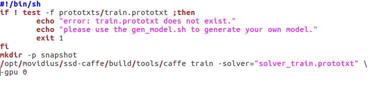
3. To start training run `train.sh` script:
```Shell
./train.sh
```
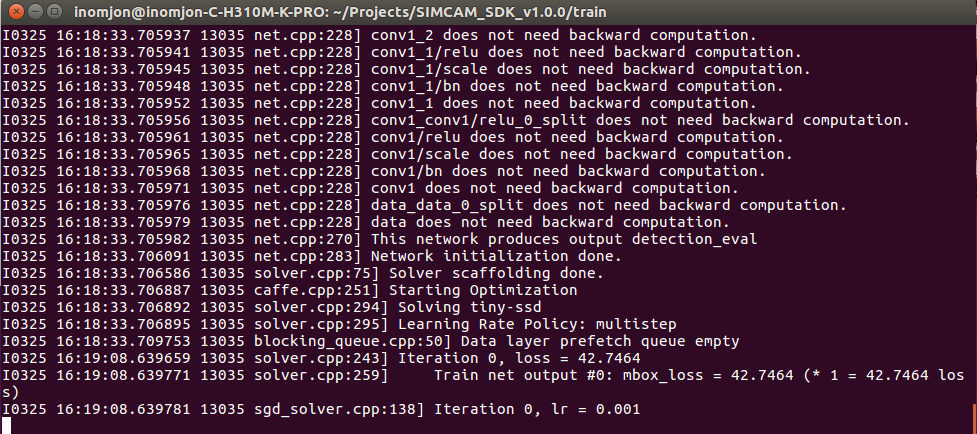
That is all your object detection model is started training.You can get a snapshot in 1000 steps. Total training lasts 120000 steps.
After all, you will get simcam_iter_xxxxx.caffemodel inside snapshot folder.  And deploy.prototxt file inside prototxts folder.

#### Convert to the graph
In installation process, we have seen description of model conversion tool, so let's convert our trained model using that tool.
```Shell
mvNCCompile deploy.prototxt -w simcam_iter_xxxxx.caffemodel -o graph -s 6
```

However, SIMACAM team has provided several robust detection models, such as [baby climb](examples/models/babyclimb) detection model, [gesture](examples/models/gesture) detection model, [person car face](examples/models/person_car_face) detection model, [pet magic](examples/models/pet_magic) detection models.  Here is some interesting results of detection for some models:
<br>
Pet magic detection model:


<br>
Baby climb detection model:


### Video_Surveillance_with_SimCam
iSpy is the world's most popular open source video surveillance application.
Here is the guide for video surveillance monitoring system with iSpy and SimCam.

1. Download and install the Open Source Camera Security Software “iSpy”. You can download it from [here](http://www.ispyconnect.com/download.aspx).

2. If iSpy has been installed successfully ,Open iSpy, and Click “Add” menu to add SimCam camera for video surveillance.
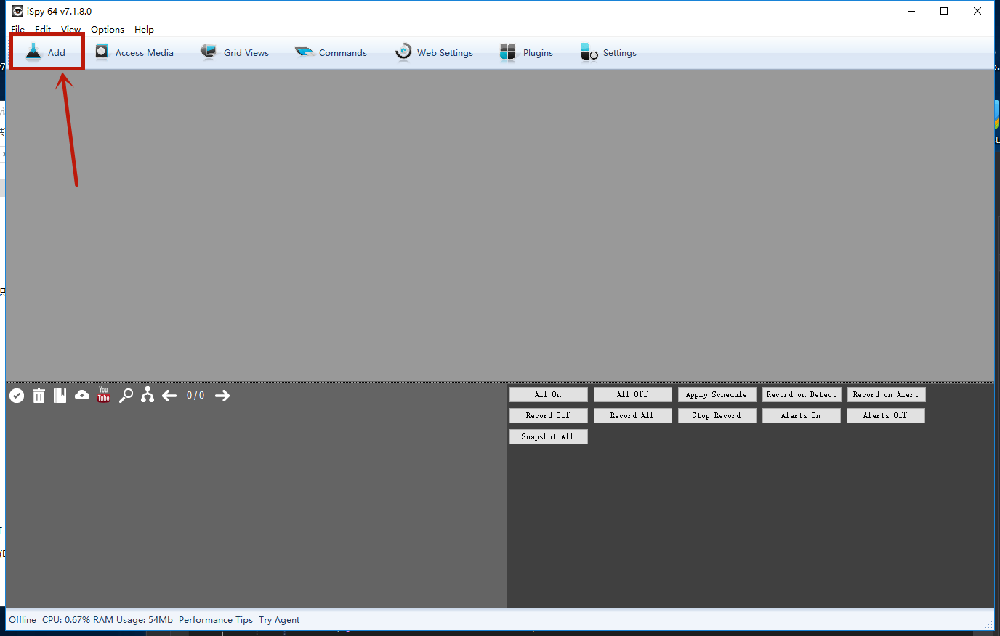
3. Open Video Source window by clicking  "IP Camera" icon.
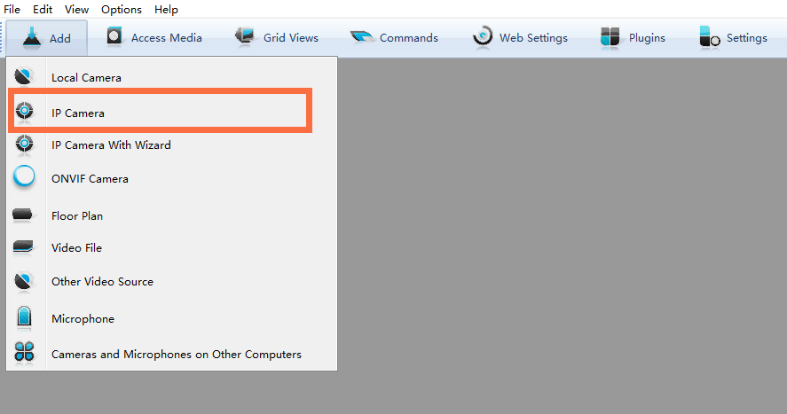
4. Choose FFMPEG（H264）menu and enter SimCam camera IP address, here is an example
   rtsp://192.168.168.171(this is Simcam IP address)
5. Click Test button to check if the camera is connected.
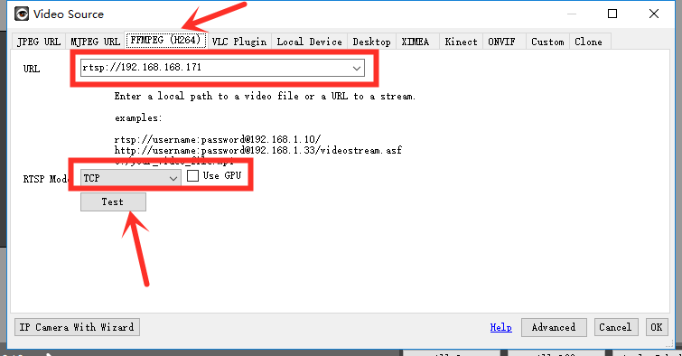
if the camera is connected we can see message box with confirmation "Connected".
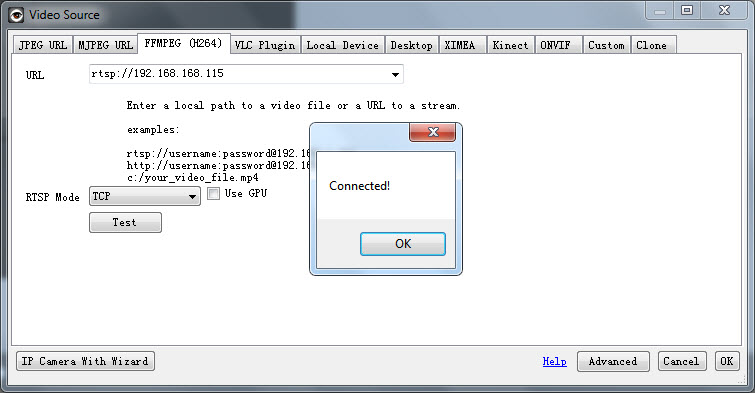
6. When you click "OK" buttons, you will be directed to the "Edit Camera" window. For simplicity, let's left all with default configuration. You just need to click "Finish" button.
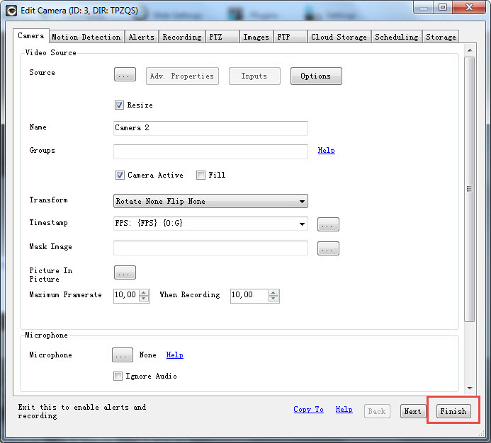
Now you can monitor your connected camera.
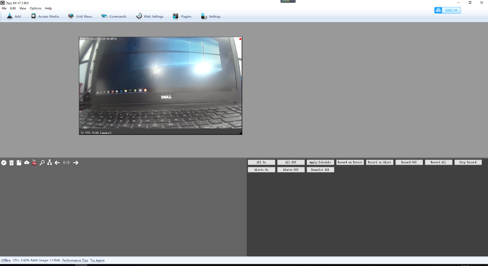

Using SIMCAM camera and its SDK  you can develop your own amazing AI applications. SIMCAM team glad to see you on this repo and wish you good luck on your AI journey!!!   
### Support
If you need any help, please post us an issue on [Github Issues](https://github.com/simshineaicamera/SIMCAM_SDK/issues) or send us an email [sdk@simcam.ai](mailto:sdk@simcam.ai).  You are welcome to contact us for your suggestions!
